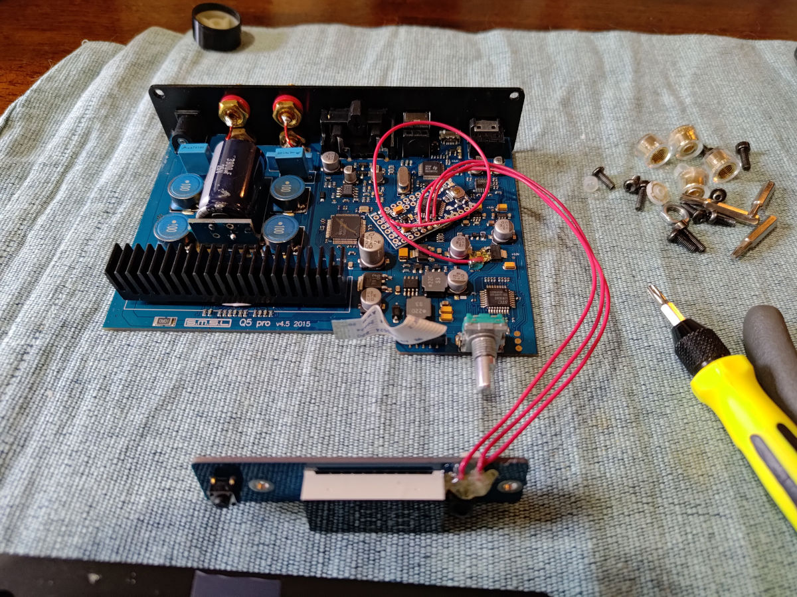
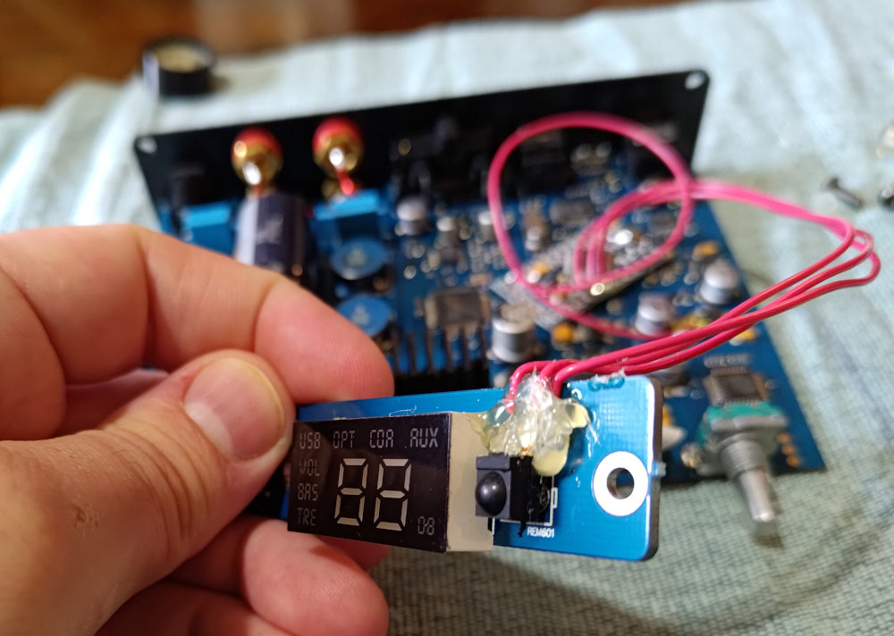

# arduino_ir_translator
Intercept infrared remote signals and swap them out for different ones!

This is a project I worked on back in January 2017 and now that I'm retiring the SMSL amplifier that I modified using this code, I finally have a chance to take it back apart and propery document everything.

*Problem Statement*: I bought a pretty decent (but cheap) 2-channel amplifier and DAC to run my floor speakers. But it used this really awful remotre controller. Fortunately my smart TV has a feature where it's remote can be set up to control your home theater, but it only supports major brands, and definitley not my SMSL amp. So I needed a way to control this amp using the same IR signals as a name brand unit so I could use my existing TV remote with it and throw away the junky one that came with it.

Solution: This repo! And some sketchy hacking of an Arduino Pro Mini into the amp that man-in-the-middles the IR sensor. I arbitrariy chose Yamaha to be the name brand that I translate from.

